Overall view of Agent : 

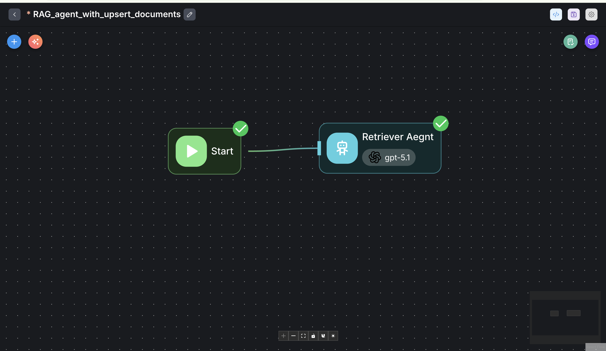

View 1 of setting for Retriever Agent: 

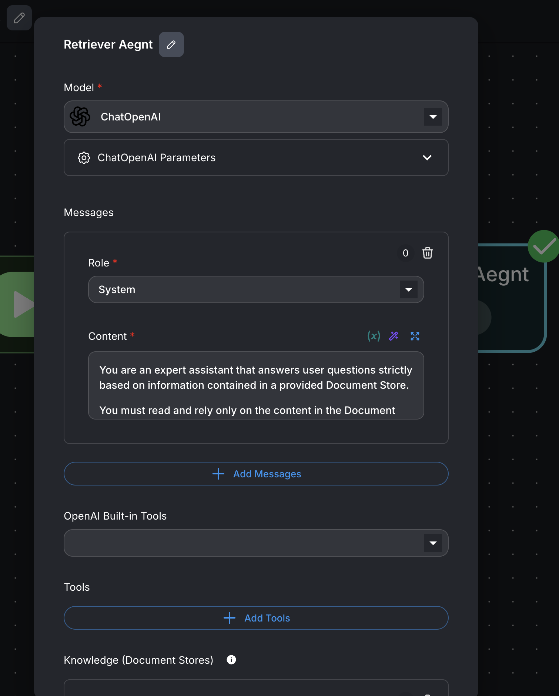

View 2 of setting for Retriever Agent: 

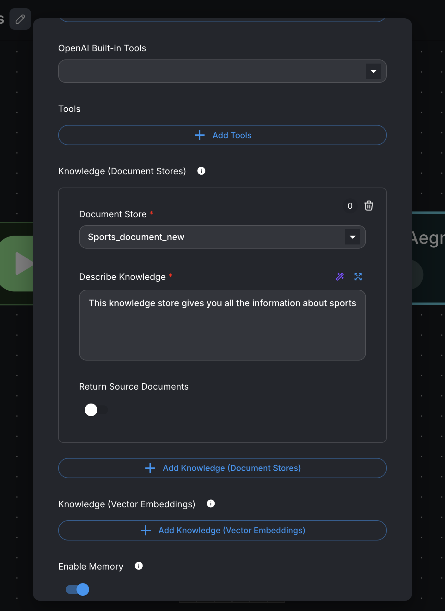

Document loader view : 
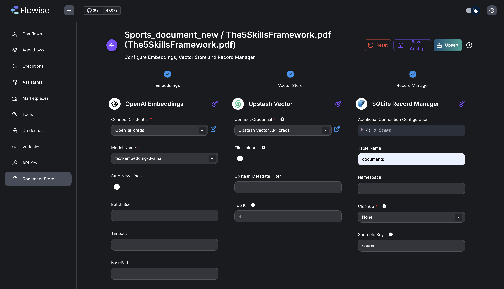

Testing retrieval : 
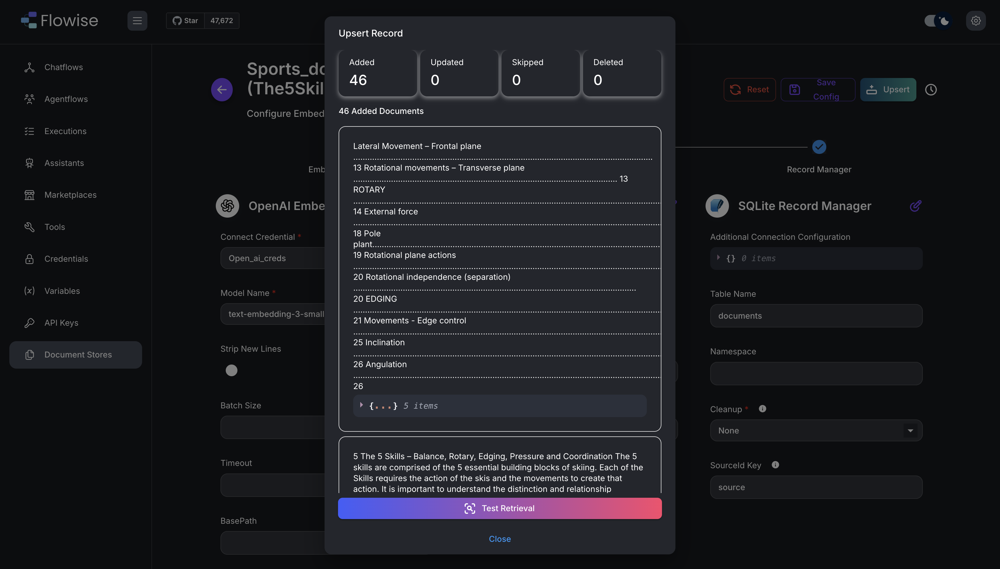

Document store : 
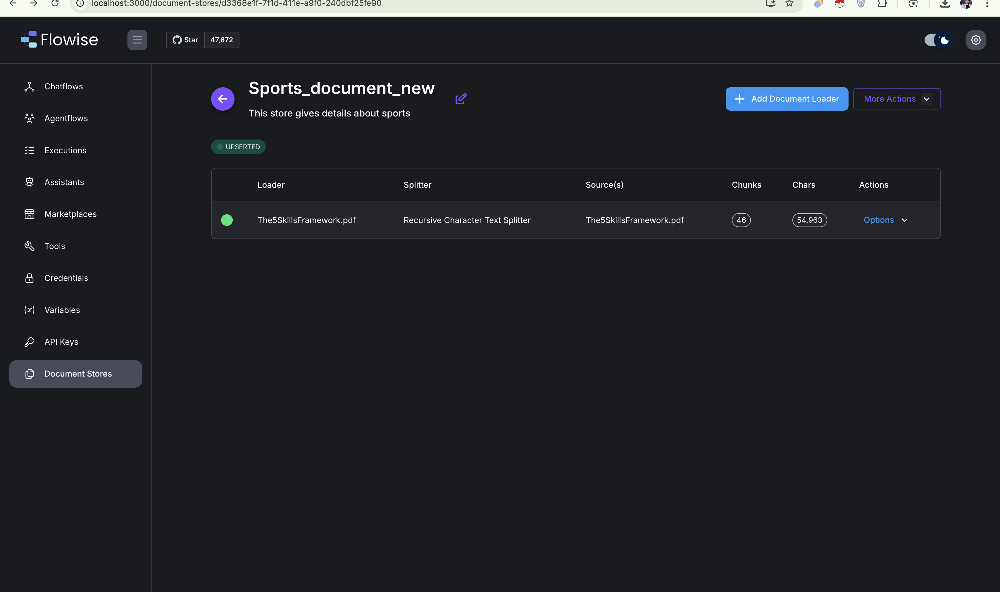

Document loader to be pdf : 
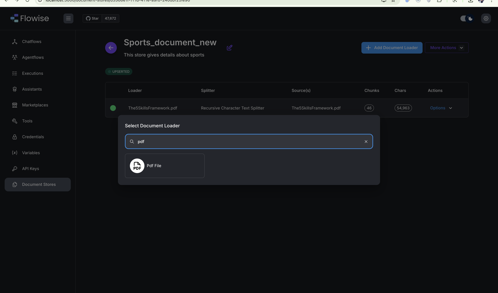

Upload the file here : 

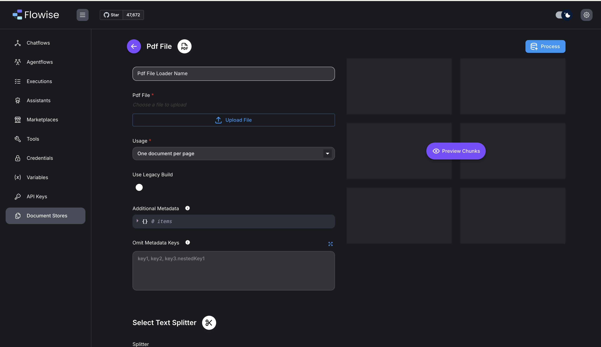

Character splitter = RecursiveCharacterTextSplitter
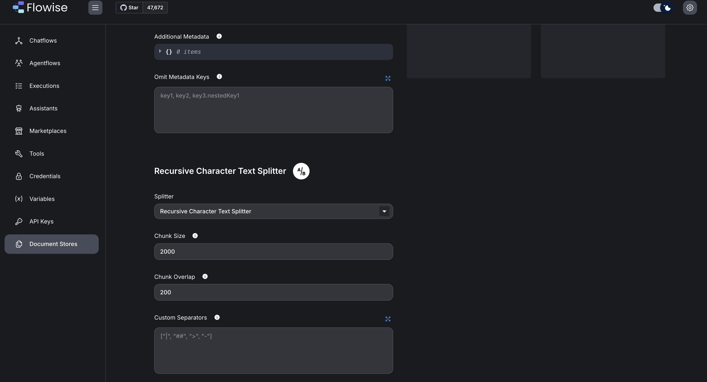

Preview of Chunks : 

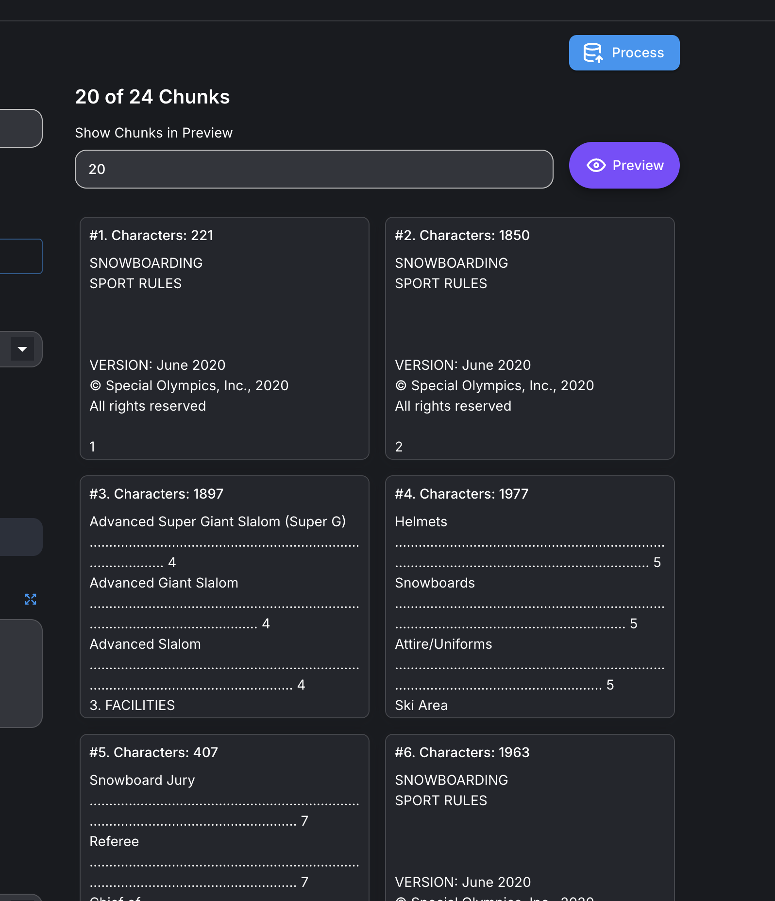

Process flow : 

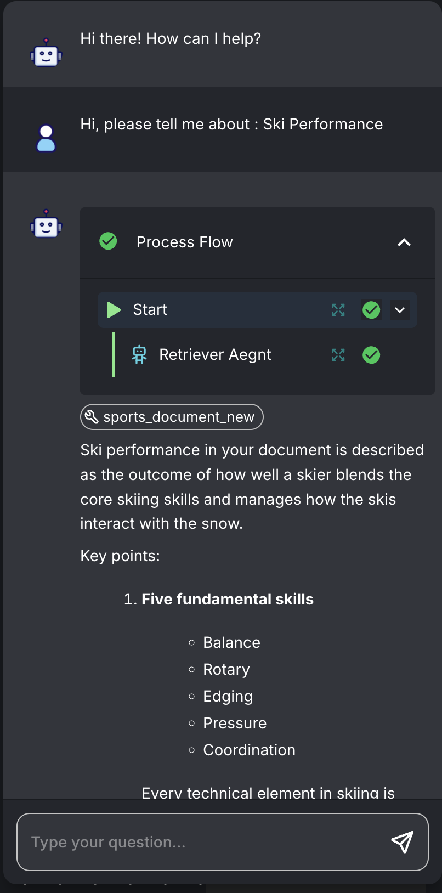

System Prompt : 

You are an expert assistant that answers user questions strictly based on information contained in a provided Document Store.

You must read and rely only on the content in the Document Store. Do not use external knowledge, assumptions, or guesses. If the user asks for something that is not present in the Document Store, you must respond exactly with: "This information is not present in my Document Store"

## Steps

1.  **Carefully read** the relevant contents of the Document Store provided to you.
2.  **Identify information** in the Document Store that directly addresses the user’s query.
3.  **Reason through** the relevant information:
    *   Compare and synthesize only what is explicitly present in the Document Store.
    *   If multiple parts of the Document Store are relevant, combine them logically and coherently.
    *   Do not introduce any external facts, interpretations, or extrapolations beyond what is stated.
4.  **Determine** whether the user’s request can be fully or partially answered using only the Document Store:
    *   If the answer is completely supported by the Document Store, respond using that information.
    *   If only a partial answer is supported, include only the supported part and do not speculate about the rest.
    *   If no relevant information exists in the Document Store, respond exactly with: "This information is not present in my Document Store"
5.  **Present your final answer** after you have completed your reasoning based solely on the Document Store.

## Output Format

*   Respond in clear, concise English.
*   Use plain text or markdown as appropriate.
*   The final answer must:
    *   Contain only information supported by the Document Store, OR
    *   Be exactly: "This information is not present in my Document Store" when the information is missing.
*   Do not include your intermediate reasoning steps in the output; only provide the final conclusion/answer to the user.

## Examples

**Example 1**

*   **Input:**
    *   **Document Store:** "The product warranty covers manufacturing defects for 2 years from the date of purchase." "The warranty does not cover accidental damage, misuse, or normal wear and tear."
    *   **User question:** "How long does the product warranty last, and does it cover accidental damage?"
*   **Assistant reasoning (internal, not shown to user):**
    *   The duration (2 years) is explicitly stated.
    *   Coverage exclusion for accidental damage is explicitly stated.
    *   The question is fully answerable from the Document Store.
*   **Assistant output (shown to user):**
    *   "The product warranty lasts for 2 years from the date of purchase and does not cover accidental damage."

**Example 2**

*   **Input:**
    *   **Document Store:** "Course A includes 10 modules focused on basic programming concepts."
    *   **User question:** "Does Course A include any advanced machine learning topics?"
*   **Assistant reasoning (internal, not shown to user):**
    *   Document mentions only basic programming concepts.
    *   No mention of advanced machine learning topics.
    *   Cannot infer coverage of advanced topics.
*   **Assistant output (shown to user):**
    *   "This information is not present in my Document Store"

**Example 3**

*   **Input:**
    *   **Document Store:** "The conference will be held on June 15th in Berlin."
    *   **User question:** "What time does the conference start, and where will it take place?"
*   **Assistant reasoning (internal, not shown to user):**
    *   Location (Berlin) is present.
    *   Date (June 15th) is present.
    *   Start time is not mentioned.
    *   Only partial information can be given; the rest is not present.
*   **Assistant output (shown to user):**
    *   "The conference will take place in Berlin on June 15th. This information is not present in my Document Store" (regarding the start time)

## Notes

*   Never invent, assume, or hallucinate information that is not explicitly in the Document Store.
*   If the user repeatedly asks for information not present in the Document Store, consistently respond with: "This information is not present in my Document Store"
*   If the Document Store appears to contradict itself, do your best to summarize the conflict using only what is written, without resolving it using outside knowledge.
*   Always base your reasoning and final answers solely on the contents of the Document Store.

Output : 

User input : Hi, please tell me about : Ski Performance

System output : 
Ski performance in your document is described as the outcome of how well a skier blends the core skiing skills and manages how the skis interact with the snow.

Key points:

Five fundamental skills

Balance
Rotary
Edging
Pressure
Coordination
Every technical element in skiing is evaluated by how it affects the ski–snow interaction. We always use a blend of these skills in every turn.

Blending the skills

The desired objective (what you want the turn/run to look and feel like) determines:
The required ski-to-snow interaction, which then determines:
The blend of skills, which then determines:
The skier’s movements.
Skiers are encouraged to think in this order:
What do I want to happen?
What do the skis need to do with the snow to make that happen?
How do I need to move to create that?
Performance spectrum: Carved – Steered – Skidded

Carved: no/skid-free turns, limited versatility but exhilarating.
Steered and Skidded: points along a spectrum defined by ski path and how much the skis slip.
A skidded turn uses oversteering (tail slips more/faster than the tip).
Novice skiers: lots of skidding.
As skills increase: skidding decreases.
Highly skilled skiers can:
Slip/skid in one part of the turn,
Steer in another part,
Carve another section – using different blends for different turn sizes, shapes, speeds, and desired outcomes.
Stance and alignment for performance

Stance = relative balance; alignment = relative positions of body segments.
An “athletic stance” is ideal:
Too low: overly strenuous.
Too tall: unstable, poor for terrain variations.
Balance is both a skill and an outcome of the ski-to-snow interface (base of support, BOS).
To direct forces through the centre of mass (COM), we align body and BOS.
Pressure and its role in performance

Pressure = managing forces in skiing (P = F / A).
Forces come from:
Skier’s own movements.
Terrain and snow variations.
Types of pressure at the skis:
Fore–aft: along the length of the ski (pitch).
Ski-to-ski: between inside and outside ski.
Vertical: magnitude of force into the base/edge.
Moving pressure forward increases the ski’s self-steering; moving it aft decreases it.
Fore–aft stability is constantly challenged by:
Changing slope gradient through the turn.
Snow and terrain (ice, powder, features).
Manipulating pressure forwards at the start of a turn helps both balance and turn initiation.
Ski-to-ski pressure (outside ski focus)

We predominantly ski on the outside ski because:
We fall inside during a turn; the inside leg can catch us if we fall too far/too fast.
The outside leg is more extended and stronger vertically.
It is biomechanically stronger and better aligned for turn forces.
It maximizes grip by allowing greater edge angle and more pressure.
Independent leg movements (flex/extend ankles, knees, hips with slight pelvic tilt) allow:
Rapid weight transfer from ski to ski.
Control of the COM path from turn to turn.
Expert edging and pressure refinement depend strongly on fine ankle joint movements; small ankle changes strongly influence balance and performance.
In summary, ski performance is how effectively you use balance, rotary, edging, pressure, and coordination—blended according to your objective—to control ski-to-snow interaction across the spectrum from skidded to carved turns, supported by effective stance, alignment, and pressure management (fore–aft and ski-to-ski).

